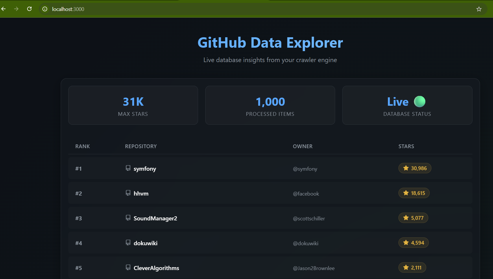
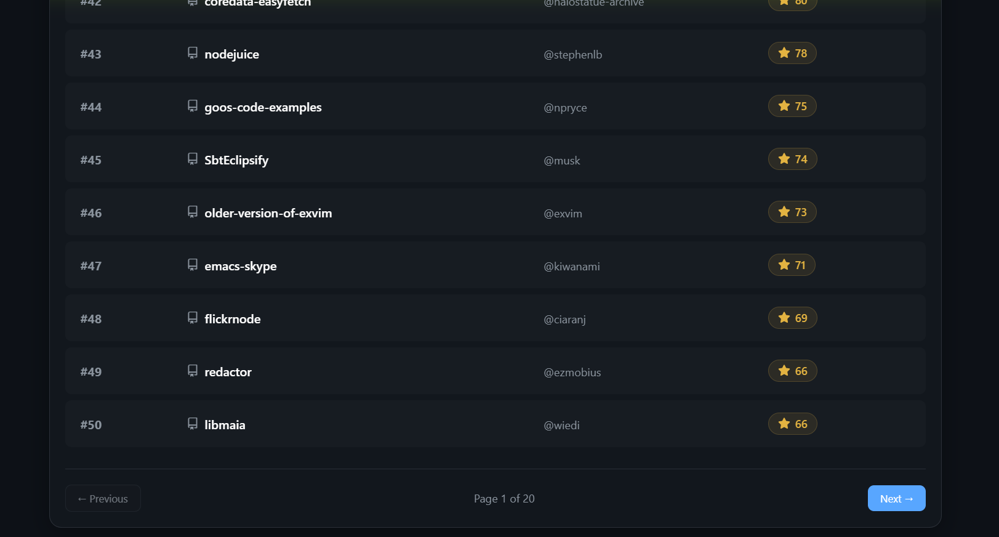

# GitHub Crawler

A high-performance repository crawler built with Node.js, TypeScript, and PostgreSQL. It uses Clean Architecture patterns to systematically paginate through GitHub's GraphQL API, respecting the `GITHUB_TOKEN` rate limits (1000 requests/hour mapping to exact 100k repositories crawled).

## Live Output

The crawler stores data in PostgreSQL and exposes it via a local web dashboard:





> **1,000 repositories processed** in a single run, with max 30,986 stars recorded. Pagination across 20 pages of results.

---

## Quickstart (Zero Setup - No Docker Required)

1. Create a `.env` file and set your `GITHUB_TOKEN`:
   ```bash
   cp .env.example .env
   ```
   *(Note: Leave `DATABASE_URL` empty to run without Docker. It will save results to `crawled_repositories.json` locally).*

2. Install and run:
   ```bash
   npm install
   npm run build

   # Crawl up to 1,000 repositories (runs fast and saves to local JSON)
   npm run start 1000
   ```

## Cloud (GitHub Actions)

This project is pre-configured with GitHub Actions. When you push to the `main` branch, it automatically:
- Spins up a real Postgres database in the cloud.
- Runs the crawler.
- Dumps the database results into a `database_dump.sql` artifact for you.
- **No local Postgres or Docker installation is needed!**

## Design Overview

- **Domain**: Holds pure `Repository` entity models and storage interfaces.
- **Adapters**: Features the `GitHubGraphQLAdapter` which elegantly manages pagination across multiple date boundaries, to bypass the 1,000 search result limit limitation natively enforced by GitHub's API.
- **Use Cases**: `CrawlRepositoriesUseCase` bridges API generator logic to efficient Upserting in `PostgresRepositoryAdapter`.

See `SCALING_AND_EVOLUTION.md` for discussion on architectural scalability to 500M repositories and relational database partitioning/modifications.
